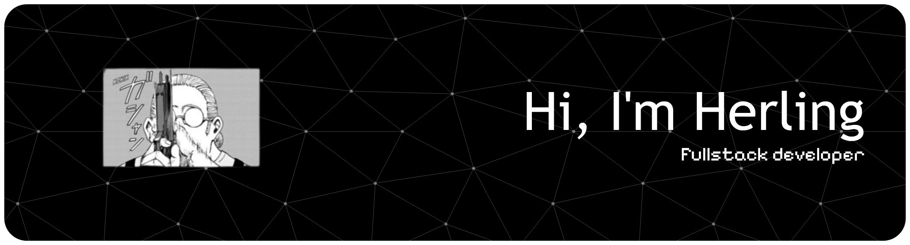

# 
Hi, there! :wave:

  <!-- RIGHT -->

<h3 style="margin:0;" align="center">Skills</h3>

  <!-- COL 1 -->

<h5>Languages</h5>

<h5>UI / Component Library</h5>

<h5>Tools</h5>

  <!-- COL 2 -->

<h5>Frameworks</h5>

<h5>Databases</h5>

